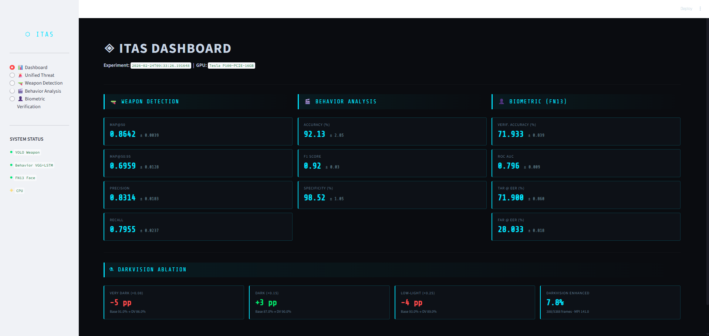
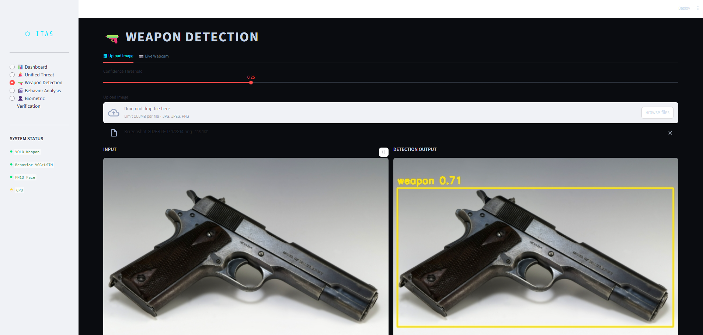
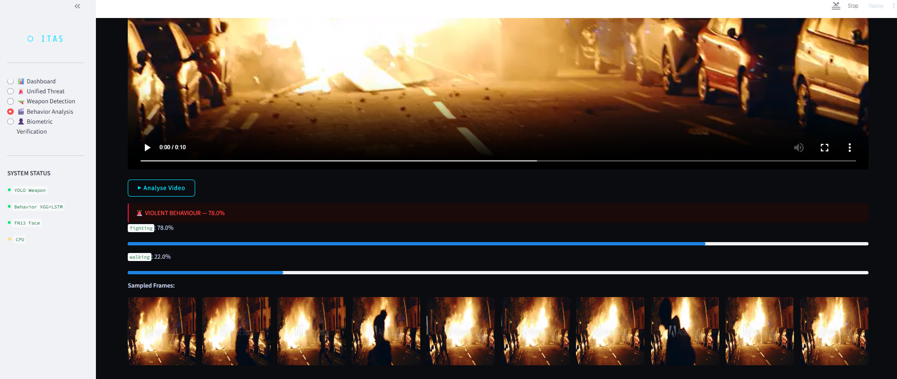
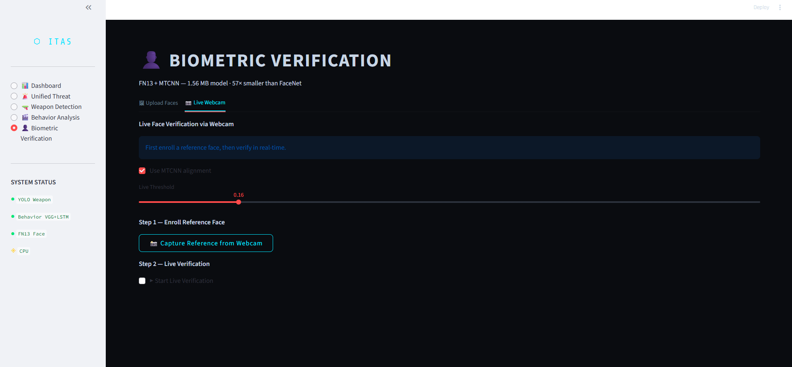
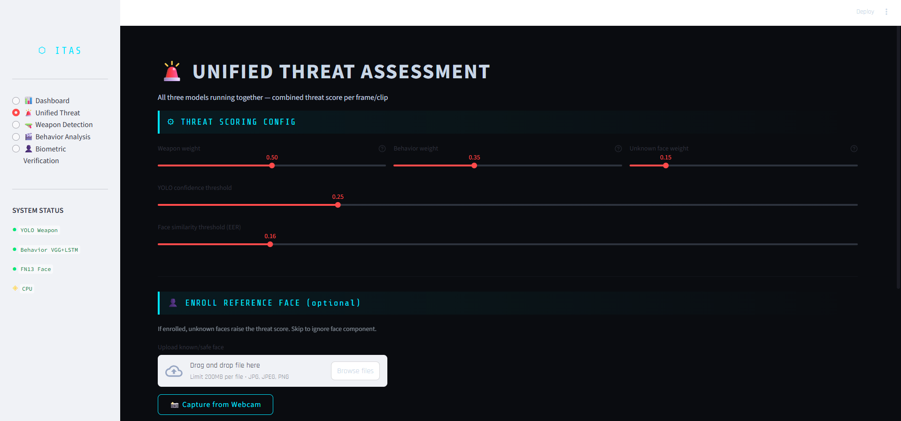

# ITAS — Intelligent Threat Assessment System


> A multi-modal AI surveillance system combining weapon detection, behavior analysis, and biometric verification into a unified real-time threat scoring pipeline.

---

## 📸 Screenshots

> **Dashboard — Experiment Results**
<!-- Replace with your actual screenshot -->


> **Weapon Detection — DarkVision Enhanced**
<!-- Replace with your actual screenshot -->


> **Behavior Analysis — Fighting vs Normal**
<!-- Replace with your actual screenshot -->


> **Biometric Verification — Face Pair Matching**
<!-- Replace with your actual screenshot -->


> **Unified Threat Assessment — Live Score**
<!-- Replace with your actual screenshot -->


---

## Overview

ITAS integrates three independently trained deep learning models into a single Streamlit application. Each module runs standalone or together through the **Unified Threat Assessment** engine, which computes a weighted composite threat score and classifies it into four alert levels.

| Alert Level | Score | Description |
|---|---|---|
| 🔴 CRITICAL | ≥ 75% | Immediate threat — weapon + violent behavior detected |
| 🟠 HIGH | ≥ 50% | Strong threat signal from one or more modules |
| 🟡 MODERATE | ≥ 25% | Elevated risk — requires monitoring |
| 🟢 LOW | < 25% | No significant threat detected |

---

## Modules

### 🔫 Module 1 — Weapon Detection
**Model:** YOLOv11n + DarkVision  
**Task:** Real-time weapon detection in images, video, and live webcam feed

- Custom **DarkVision** preprocessing applies adaptive gamma correction to frames with Mean Pixel Intensity (MPI) ≤ 55, boosting detection in low-light conditions
- Trained on a real-world curated weapon dataset over 3 seeded runs (60 epochs each)
- Supports single image upload, video clip analysis, and live webcam inference

| Metric | Mean | Std |
|---|---|---|
| mAP@0.5 | 0.8642 | ±0.0039 |
| mAP@0.5:0.95 | 0.6959 | ±0.0128 |
| Precision | 0.8314 | ±0.0183 |
| Recall | 0.7955 | ±0.0237 |

---

### 🎬 Module 2 — Behavior Analysis
**Model:** VGG16 + 2-layer LSTM  
**Task:** Violence classification from video sequences (fighting vs. normal)

- Extracts 10 uniformly sampled frames per clip, resized to 224×224
- VGG16 features passed through a 2-layer LSTM with a fully connected head
- Trained over 3 seeded runs (20 epochs each) on the Real-Life Violence Situations dataset
- Supports video upload, 10-frame manual upload, and live webcam rolling-window analysis

| Metric | Mean | Std |
|---|---|---|
| Accuracy | 92.13% | ±2.85% |
| F1 Score | 0.919 | ±0.030 |
| Specificity | 98.52% | ±1.047% |

---

### 👤 Module 3 — Biometric Verification
**Model:** FN13 + MTCNN  
**Task:** Pair-wise face verification (same person / different person)

- FN13 is a custom lightweight CNN trained with Center Loss for compact identity embeddings
- MTCNN used for face alignment and preprocessing
- **1.56 MB model size — 57× smaller than FaceNet (89 MB)**
- Supports image upload verification and live webcam identity enrollment + verification

| Metric | Mean | Std |
|---|---|---|
| Verification Accuracy | 71.93% | ±0.84% |
| ROC AUC | 0.796 | ±0.009 |
| TAR @ EER | 71.9% | ±0.86% |
| FAR @ EER | 28.03% | ±0.82% |

---

### 🚨 Module 4 — Unified Threat Assessment
**Task:** All three models running together with a configurable weighted scoring engine

```
Threat Score = (w_weapon × weapon_score) + (w_behavior × behav_score) + (w_face × face_score)
```

- Default weights: Weapon 50% · Behavior 35% · Face 15% (adjustable via sliders)
- Three inference modes: single image, video clip with timeline chart, live webcam HUD
- Face component activates only when a reference identity is enrolled

---

## Architecture


---

## Tech Stack

| Category | Technologies |
|---|---|
| Deep Learning | PyTorch, TorchVision |
| Object Detection | Ultralytics YOLOv11n |
| Face Detection | facenet-pytorch (MTCNN) |
| Computer Vision | OpenCV |
| Frontend | Streamlit |
| Visualization | Matplotlib |
| Data | NumPy, Pillow |

---

## Project Structure

```
itas_app/
├── app.py                  # Main Streamlit application
├── requirements.txt        # Python dependencies
├── ALL_METRICS.json        # Experiment results (all 3 runs)
├── models/
│   ├── yolo_weapon.pt      # YOLOv11n trained weights
│   ├── behavior_model.pth  # VGG16+LSTM trained weights
│   └── fn13_face.pth       # FN13 trained weights
└── screenshots/            # App screenshots (see above)
```

---

## Setup & Running Locally

**1. Clone the repository**
```bash
git clone https://github.com/PiyushAgarwalcs/itas-app.git
cd itas-app
```

**2. Install dependencies**
```bash
pip install -r requirements.txt
```

**3. Add model files**

Place your trained model files in the `models/` folder:
```
models/yolo_weapon.pt
models/behavior_model.pth
models/fn13_face.pth
```

**4. Run the app**
```bash
streamlit run app.py
```

Open `http://localhost:8501` in your browser.

---

## Training Details

All models were trained on a **Tesla P100-PCIE-16GB GPU** (Kaggle environment). Each experiment was run **3 times with different seeds** to ensure reproducibility and report mean ± std metrics.

| Module | Dataset | Epochs | Runs | Avg. Train Time |
|---|---|---|---|---|
| Weapon Detection | Real-world curated | 60 | 3 | ~32.5 min/run |
| Behavior Analysis | Real-Life Violence Situations | 20 | 3 | ~4.7 min/run |
| Biometric Verification | PINS Face Recognition | 40 | 3 | ~0.3 min/run |

Full metrics available in [`ALL_METRICS.json`](ALL_METRICS.json).

---

## DarkVision Ablation

Effect of DarkVision preprocessing on weapon detection at different darkness levels:

| Darkness Level | Factor | Baseline Det. | DarkVision Det. | Change |
|---|---|---|---|---|
| Very Dark | 0.08 | 91% | 86% | −5 pp |
| Dark | 0.15 | 87% | 90% | **+3 pp** |
| Low-Light | 0.25 | 93% | 89% | −4 pp |

DarkVision enhanced **7.76% of frames** (388 / 5,388) in the test set with a mean MPI of 141.

---

## Author

**Piyush Agarwal**  
B.Tech Computer Science & Engineering — SRM Institute of Science and Technology

###### [piyushagarwal2003k@gmail.com]

----

## License

This project is for academic and portfolio purposes.
